# Taller Bintec 2026 — Guía paso a paso del flujo en n8n

Esta guía es para quien **nunca ha usado n8n**. Arma el mismo flujo de 15 nodos de la guía del taller
([`Taller_Bintec_Guia_Completa.pdf`](Taller_Bintec_Guia_Completa.pdf)), pero clic a clic y con
capturas, adaptado a este repositorio. Cada paso dice qué buscar, qué escribir y qué deberías ver al
ejecutar.

> **Video:** el mismo proceso, de principio a fin y narrado en español, en
> [`VIDEO-PASO-A-PASO.mp4`](VIDEO-PASO-A-PASO.mp4) (12:41). Capítulos: 0:00 Webhook · 1:57 Preparar los datos · 2:27 Risk, Fraud y CRM · 4:46 Merge y Combinar respuestas · 5:54 Gemini Agent · 7:31 Parsear, auditoría y guardrail · 8:45 If, revisión humana y respuesta · 10:49 Probar y publicar.
> El video copia los valores desde `snippets/` y deja los nombres por defecto de n8n (`Edit Fields`,
> `HTTP Request1`, `Code in JavaScript2`…), como la solución: los nombres que propone esta guía son
> opcionales, salvo `Combinar respuestas` y `Gemini Agent`, que sí son obligatorios.

> **⚠️ No copies código desde este PDF.** Al pegarlo en n8n, los saltos de línea del PDF quedan
> dentro del código o de la expresión y el nodo se muestra con errores (texto en rojo, *SyntaxError*,
> *Unexpected token*), aunque se vea igual. Copia los valores largos (código, bodies JSON, prompt de
> Gemini) desde la carpeta [`snippets/`](https://github.com/juan-manjarr/taller-n8n-bintec-2026/blob/main/snippets) del repositorio, o desde la
> [versión web de esta guía](https://github.com/juan-manjarr/taller-n8n-bintec-2026/blob/main/docs/GUIA-PASO-A-PASO.md) con el botón de copiar de cada bloque. En VS Code o Codespaces:
> abre el archivo, `Ctrl+A`, `Ctrl+C`. Cada paso indica qué archivo usar; el
> [README de `snippets/`](https://github.com/juan-manjarr/taller-n8n-bintec-2026/blob/main/snippets/README.md) tiene todos los valores en tablas.

> **Diferencia con el PDF:** aquí la URL y la llave del modelo van en el archivo `.env`. Los pasos 5 y
> 6 del PDF (crear la API key y la credencial de n8n) **no hacen falta**.

> **Antes de empezar, una advertencia:** n8n trae un **asistente de IA** (el botón ✦ de la derecha,
> "Ask n8n Assistant", "Build an agent", "Connect a model"). **En este taller no se usa.** El flujo se
> construye a mano, nodo por nodo; el modelo de lenguaje solo se llama desde **un** nodo (paso 8), y la
> llave del taller únicamente funciona ahí.

Puedes trabajar **con Docker en tu equipo** o, si no puedes instalarlo, **en GitHub Codespaces**
desde el navegador (sección 1). El resto de la guía es igual en los dos casos.

## Contenido

0. [Conceptos mínimos de n8n](#0-conceptos-mínimos-de-n8n)
1. [Preparar el entorno](#1-preparar-el-entorno) — [con Docker](#opción-a-con-docker-en-tu-equipo) o [en Codespaces](#opción-b-en-github-codespaces-sin-docker)
2. [Entrar a n8n](#2-entrar-a-n8n)
3. [Crear el workflow](#3-crear-el-workflow)
4. [Paso 1 — Webhook](#4-paso-1--webhook)
5. [Paso 2 — Preparar payload](#5-paso-2--preparar-payload)
6. [Pasos 3, 4 y 5 — Risk, Fraud y CRM en paralelo](#6-pasos-3-4-y-5--risk-fraud-y-crm-en-paralelo)
7. [Paso 6 — Merge](#7-paso-6--merge)
8. [Paso 7 — Combinar respuestas](#8-paso-7--combinar-respuestas)
9. [Paso 8 — Gemini Agent (el modelo)](#9-paso-8--gemini-agent-el-modelo)
10. [Pasos 9, 10 y 11 — Parsear, auditar y calcular el guardrail](#10-pasos-9-10-y-11--parsear-auditar-y-calcular-el-guardrail)
11. [Paso 12 — If: ¿necesita revisión humana?](#11-paso-12--if-necesita-revisión-humana)
12. [Pasos 13 y 14 — Rama de revisión humana](#12-pasos-13-y-14--rama-de-revisión-humana)
13. [Paso 15 — Respond to Webhook](#13-paso-15--respond-to-webhook)
14. [Probar el flujo completo](#14-probar-el-flujo-completo)
15. [Publicar y probar con el script](#15-publicar-y-probar-con-el-script)
16. [Problemas comunes](#16-problemas-comunes)

---

## 0. Conceptos mínimos de n8n

| Concepto | Qué es |
|---|---|
| **Workflow** | El flujo completo: una cadena de nodos conectados en el lienzo (*canvas*). |
| **Nodo** | Un paso del flujo: recibir una petición, llamar una API, ejecutar código, decidir… |
| **Trigger** | El primer nodo, el que arranca el flujo. Aquí es un **Webhook** (una URL que recibe un POST). |
| **Item** | Cada dato que viaja entre nodos es un objeto JSON. En este flujo siempre viaja **1 item**. |
| **Expresión** `{{ }}` | Texto que n8n calcula al ejecutar. `{{ $json.customer_id }}` = el campo `customer_id` del item que entra al nodo. Los campos en modo *Expression* se ven en verde. |
| **`$('Nombre')`** | Lee el resultado de **otro** nodo por su nombre. Por eso algunos nodos deben llamarse exactamente como dice esta guía. |
| **Ejecución de prueba** | Mientras construyes, ejecutas el flujo desde el editor y ves los datos de cada nodo. |
| **Publicar** | Deja el flujo activo en su URL de producción (`/webhook/...`) sin necesidad del editor. |

**El panel de un nodo.** Al hacer doble clic en un nodo se abre su panel, que tiene tres columnas:
**INPUT** (lo que recibe del nodo anterior), **Parameters** (su configuración) y **OUTPUT** (lo que
produjo en la última ejecución). Trabajar con datos reales en INPUT es lo que hace fácil construir: por
eso en el paso 1 enviamos una solicitud de prueba antes de seguir.

**Cómo agregar nodos.**
- El **`+`** que aparece a la derecha de un nodo agrega el siguiente nodo conectado a su salida.
- Para conectar dos nodos que ya existen, **arrastra** desde el círculo de salida (derecha) de uno hasta
  el círculo de entrada (izquierda) del otro.
- Para sacar **varias ramas** de la misma salida, arrastra desde su círculo de salida y suelta en un
  espacio vacío del lienzo: se abre el buscador de nodos y el nuevo nodo queda conectado.
- Para **renombrar** un nodo, haz clic en su título dentro del panel (arriba a la izquierda), o
  selecciónalo en el lienzo y presiona `F2`.

n8n guarda los cambios automáticamente.

---

## 1. Preparar el entorno

Necesitas la **URL y la llave del modelo**: las del correo del taller (`LLM_BASE_URL` y
`LLM_API_KEY`; la llave empieza por `sk-bintec-`) o tu propia API key de Gemini:

| | `LLM_BASE_URL` | `LLM_API_KEY` |
|---|---|---|
| Llave del taller | la URL del correo | `sk-bintec-…` |
| Tu propia llave de Gemini | `https://generativelanguage.googleapis.com` | tu API key de [Google AI Studio](https://aistudio.google.com/api-keys) |

### Opción A: con Docker en tu equipo

Requisitos: Docker Desktop (o Docker Engine con Compose v2) en ejecución, y Git.

```bash
git clone https://github.com/juan-manjarr/taller-n8n-bintec-2026.git
cd taller-n8n-bintec-2026
cp .env.example .env            # PowerShell: Copy-Item .env.example .env
```

Abre `.env` y completa las dos líneas:

```
LLM_BASE_URL=<la URL>
LLM_API_KEY=<tu llave>
```

Levanta el entorno y espera a que `n8n` aparezca como `healthy`:

```bash
docker compose up -d
docker compose ps
```

n8n queda en http://localhost:5678. Los servicios simulados tienen su documentación en
http://localhost:8001/docs, http://localhost:8002/docs y http://localhost:8003/docs.

### Opción B: en GitHub Codespaces (sin Docker)

Codespaces crea una máquina en la nube de GitHub con el mismo entorno; lo usas desde el navegador.
Solo necesitas una cuenta de GitHub.

1. Abre https://github.com/juan-manjarr/taller-n8n-bintec-2026 y haz clic en
   **Code → Codespaces → Create codespace on main**.
2. Se abre un editor (VS Code en el navegador). La primera vez tarda 3–5 minutos porque descarga
   las imágenes. Cuando termina, la terminal de abajo muestra *"Imágenes descargadas. Falta un paso"*.
3. En el explorador de archivos (izquierda) abre **`.env`** (ya viene creado) y completa
   `LLM_BASE_URL` y `LLM_API_KEY`. Guarda con `Ctrl+S`.
4. En la terminal ejecuta:

   ```bash
   docker compose up -d
   ```

5. Abre la pestaña **PORTS** (junto a *TERMINAL*), busca la fila **n8n (5678)** y haz clic en el
   ícono del globo. n8n se abre en una pestaña nueva con una URL `https://…-5678.app.github.dev`.

Diferencias con la opción A durante el resto de la guía:
- Donde la guía dice `http://localhost:5678` en el navegador, usa la URL `…app.github.dev`.
- Los comandos de prueba se ejecutan **en la terminal del codespace** y son los de **bash**
  (`./scripts/test-flow.sh …`), no los de PowerShell. Las URLs de webhook que muestra n8n
  (`http://localhost:5678/...`) funcionan desde esa terminal.
- La extensión de **Postman** para VS Code viene instalada en el codespace (ícono de Postman en la
  barra lateral; pide iniciar sesión con una cuenta de Postman). Corre dentro del codespace, así que
  usa `http://localhost:5678`: por ejemplo `POST http://localhost:5678/webhook-test/solicitud-bancaria`
  con *Body → raw → JSON* y el contenido de un archivo de `requests/`.
- **No cambies la visibilidad del puerto a *Public***: cualquiera con la URL podría entrar con la
  contraseña del taller.
- El codespace se suspende tras 30 minutos sin uso. Al reabrirlo (https://github.com/codespaces)
  los servicios se levantan solos y tu flujo sigue ahí.
- Al terminar el taller, elimina el codespace en https://github.com/codespaces para no gastar tu
  cuota gratuita.

> Si cambias `.env` después (en cualquiera de las dos opciones), ejecuta otra vez
> `docker compose up -d` para que n8n tome los valores nuevos.

---

## 2. Entrar a n8n

Abre http://localhost:5678 e inicia sesión con `admin@bintec.local` / `Bintec2026!`.

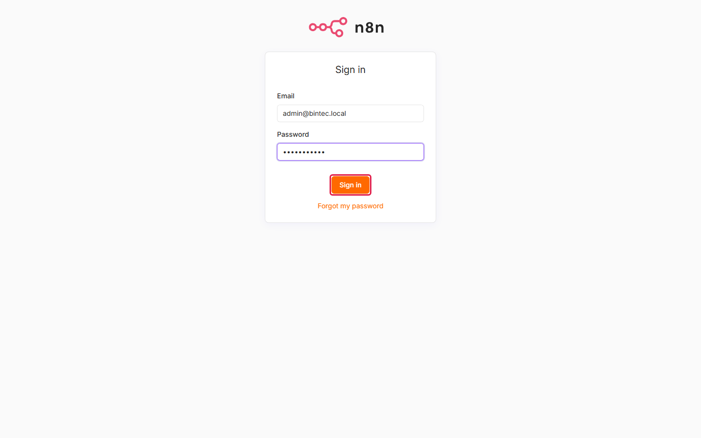

Al entrar puede aparecer la ventana **Build and debug faster with the n8n Assistant**. Haz clic en
**Set up later in Settings** (no en *Get started*): el taller no usa el asistente de IA y la llave del
taller no funciona con él.

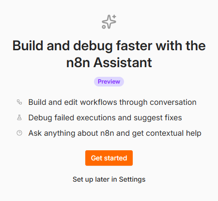

Verás la pantalla de inicio. **No uses "Build an agent"** (es el asistente de IA): el taller usa
**Build a workflow**.

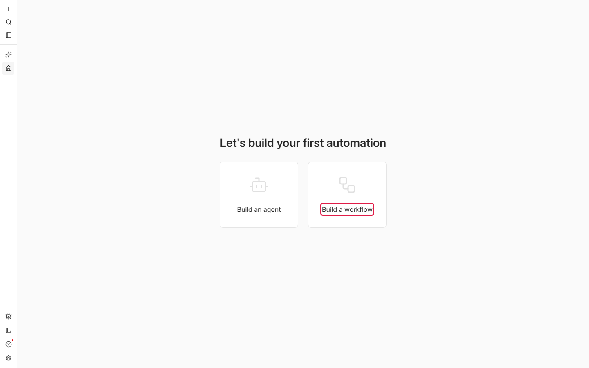

---

## 3. Crear el workflow

1. En la pantalla de inicio haz clic en **Build a workflow** (si ya creaste otro flujo antes, usa
   el botón **Create workflow** de arriba a la derecha).
2. Haz clic en el nombre *My workflow* (arriba a la izquierda) y cámbialo por
   `Flujo bancario multiagente`. El lienzo vacío muestra **Add first step…**.

   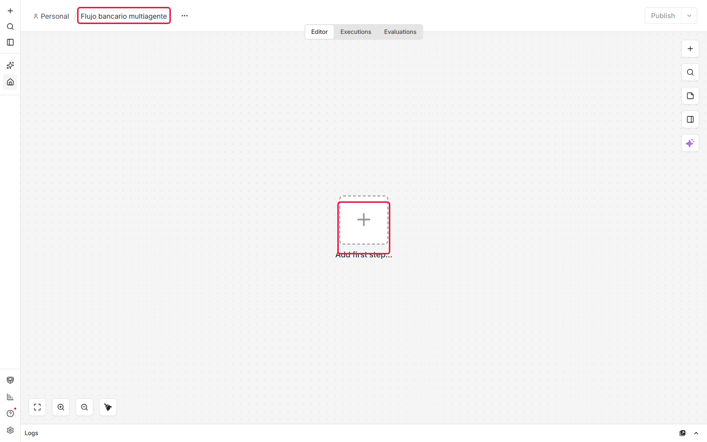

---

## 4. Paso 1 — Webhook

El webhook es la puerta de entrada: una URL que recibe la solicitud bancaria por POST.

1. Haz clic en **Add first step…**, escribe `Webhook` y presiona `Enter`.

   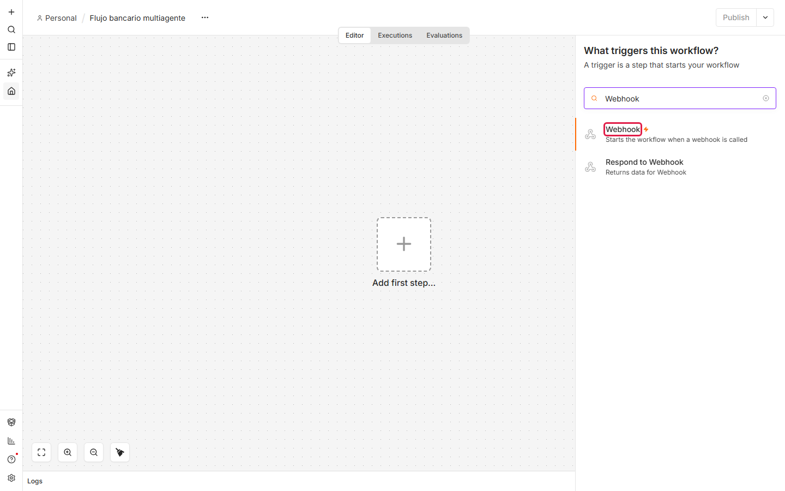

2. Configura el nodo:

   | Campo | Valor |
   |---|---|
   | HTTP Method | `POST` |
   | Path | `solicitud-bancaria` |
   | Authentication | `None` |
   | Respond | **`Immediately`** *(por ahora; en el paso 15 lo cambiamos)* |

   > **Por qué `Immediately` y no `Using 'Respond to Webhook' Node` como dice el PDF:** con esa opción
   > n8n exige que el nodo *Respond to Webhook* ya exista, y la prueba falla con
   > *"No Respond to Webhook node found in the workflow"*. Lo cambiamos al final, cuando ese nodo exista.

   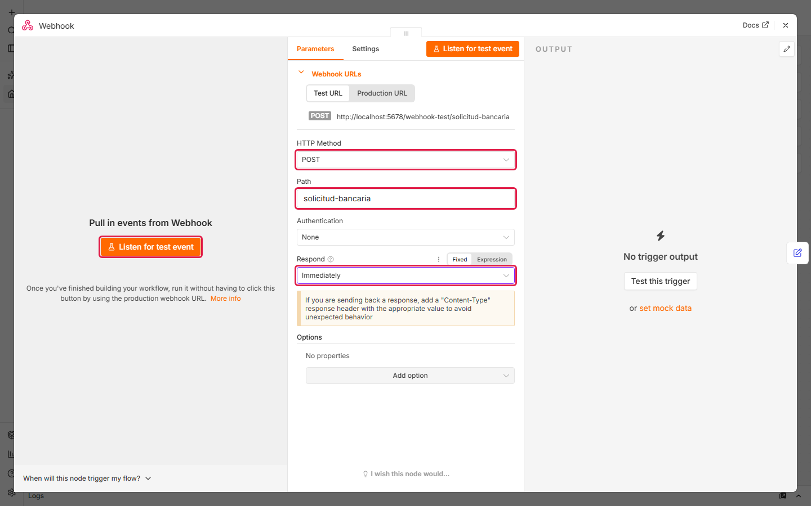

3. **Envía una solicitud de prueba** para tener datos reales con qué trabajar. Haz clic en
   **Listen for test event**. El nodo queda esperando:

   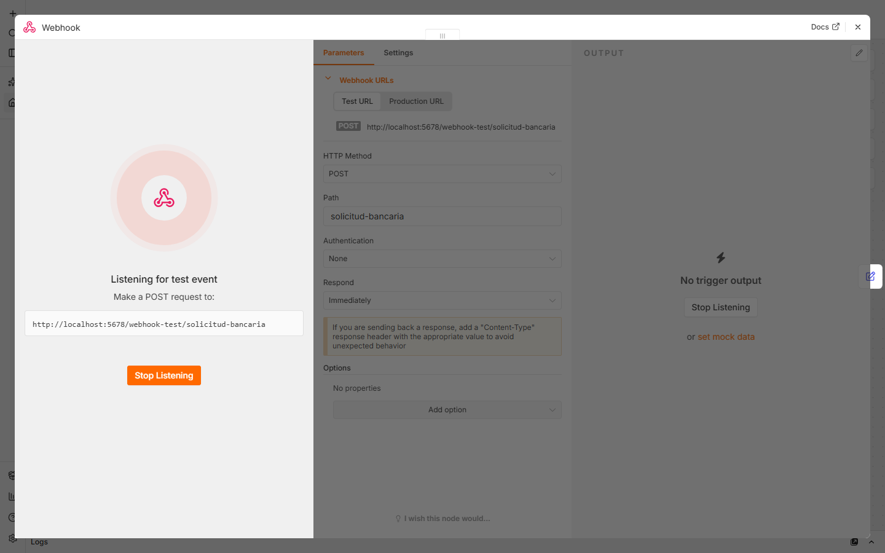

   Ahora, **desde una terminal** en la carpeta del repositorio (en Codespaces, la terminal del
   codespace con el comando de bash), envía el primer caso de ejemplo:

   ```powershell
   .\scripts\test-flow.ps1 -Test -Files requests\01-cliente-preferencial.json
   ```
   ```bash
   WEBHOOK_PATH=webhook-test ./scripts/test-flow.sh requests/01-cliente-preferencial.json
   ```

   En OUTPUT aparecen los datos recibidos; la solicitud viene dentro de **`body`**:

   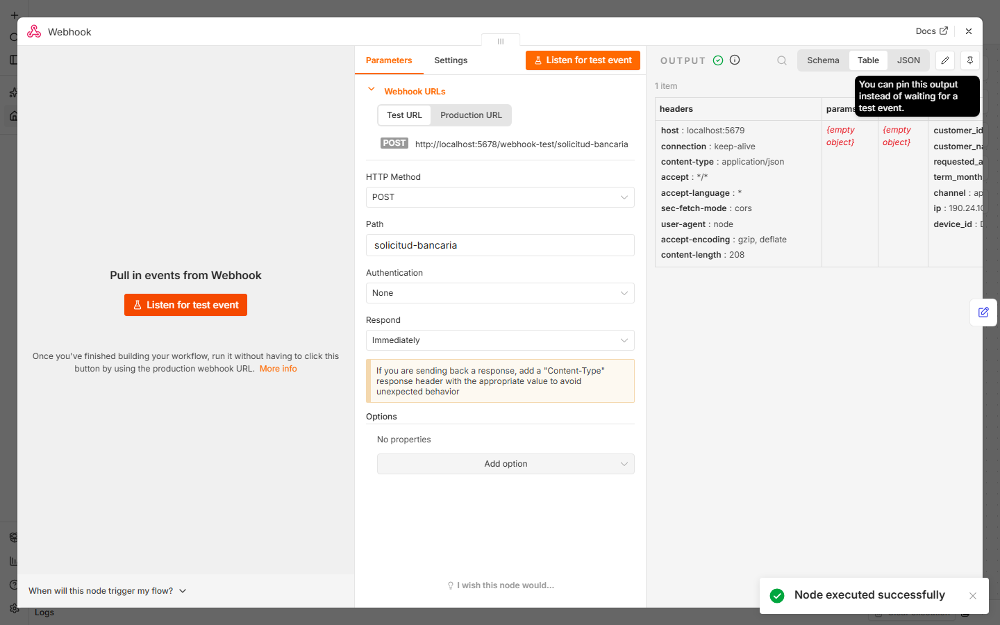

4. **Recomendado — fija (pin) estos datos.** Haz clic en el ícono de pin (📌) arriba a la derecha de
   OUTPUT. Así, cada vez que ejecutes, n8n reutiliza esta solicitud y no tienes que volver a enviarla.
   Antes de la prueba final (sección 14) quítale el pin.

5. Cierra el panel con la `X`. En el lienzo, el nodo muestra un `+` a su derecha.

   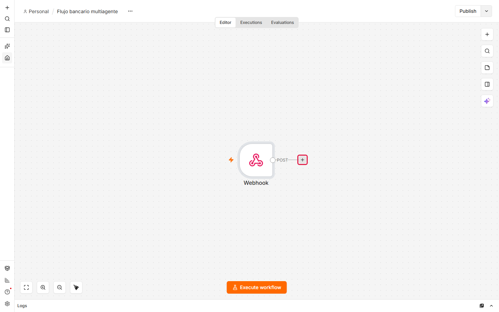

> **La URL de prueba atiende una sola solicitud por clic.** Si envías y obtienes
> *"The requested webhook ... is not registered"*, vuelve a hacer clic en *Listen for test event*
> (o en *Execute workflow*) y reenvía.

---

## 5. Paso 2 — Preparar payload

Este nodo saca los campos de `body` y los deja "planos" para los siguientes pasos.

1. Haz clic en el `+` del Webhook, busca `Edit Fields` y elige **Edit Fields (Set)**.

   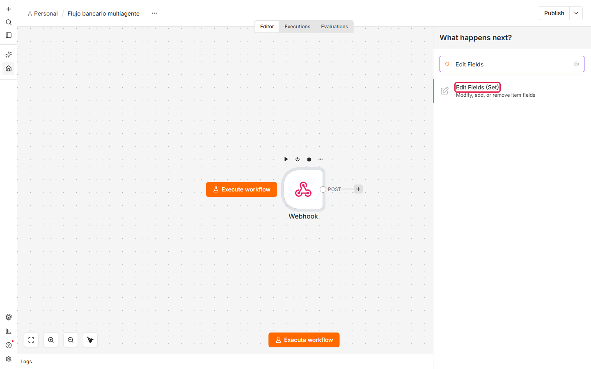

2. Renómbralo a `Preparar payload` (clic en el título del panel).

3. Como ya hay datos de prueba, la columna INPUT muestra el `body` recibido. **Arrastra** el campo
   `customer_id` (dentro de `body`) hasta la zona *Drag input fields here*:

   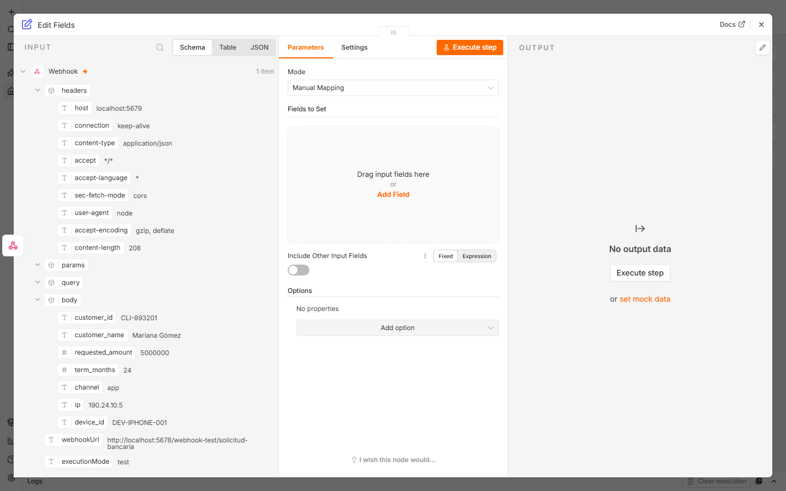

4. n8n crea el campo con el nombre **`body.customer_id`**. **Cámbialo a `customer_id`**: los nodos
   siguientes usan `$json.customer_id`, sin `body.`.

   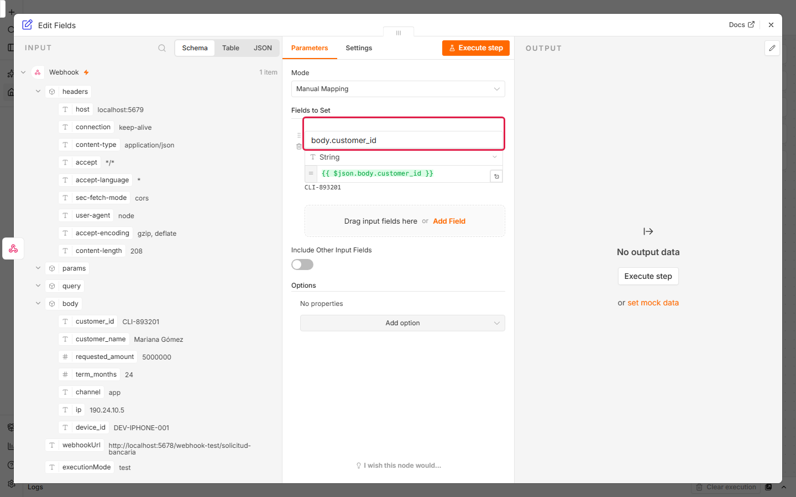

   Al hacer clic en **Execute step**, OUTPUT muestra el campo con su nombre correcto:

   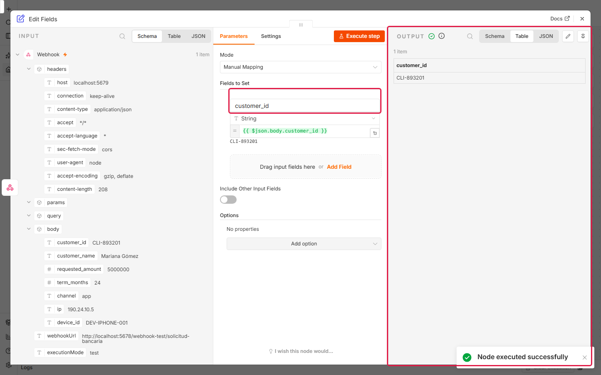

5. Repite con los demás campos hasta tener estos 7 (revisa el **tipo**: los montos son `Number`):

   | Nombre | Tipo | Valor |
   |---|---|---|
   | `customer_id` | String | `{{ $json.body.customer_id }}` |
   | `customer_name` | String | `{{ $json.body.customer_name }}` |
   | `requested_amount` | Number | `{{ $json.body.requested_amount }}` |
   | `term_months` | Number | `{{ $json.body.term_months }}` |
   | `channel` | String | `{{ $json.body.channel }}` |
   | `ip` | String | `{{ $json.body.ip }}` |
   | `device_id` | String | `{{ $json.body.device_id }}` |

   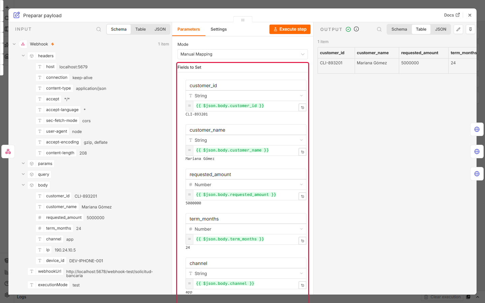

   > Si prefieres escribir en vez de arrastrar: **Add Field**, escribe el nombre, elige el tipo y en el
   > valor escribe la expresión completa empezando por `{{`. n8n cambia el campo a modo *Expression*.

   > **Atajo (como en la solución):** en *Edit Fields* cambia **Mode** a `JSON`, pon el campo **JSON** en
   > modo *Expression* y pega el contenido de [`snippets/02-preparar-payload.node.json`](https://github.com/juan-manjarr/taller-n8n-bintec-2026/blob/main/snippets/02-preparar-payload.node.json). Así los 7
   > valores llegan como texto (también los montos); los servicios los aceptan igual.

---

## 6. Pasos 3, 4 y 5 — Risk, Fraud y CRM en paralelo

Los tres servicios se consultan **en paralelo**: los tres salen de *Preparar payload*. **No los
encadenes** uno detrás de otro: si lo haces, Fraud y CRM reciben la respuesta de Risk en vez de los
datos de la solicitud y fallan.

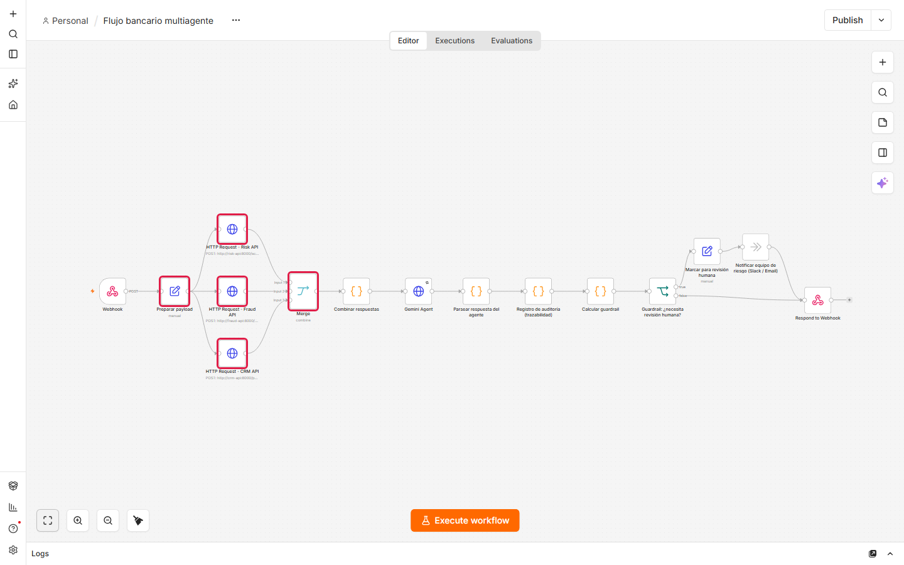

**Cómo crear las tres ramas:**
1. Haz clic en el `+` de *Preparar payload*, busca `HTTP Request` y agrégalo. Será **HTTP Request - Risk API**.
2. Para la segunda rama, **arrastra desde el círculo de salida de *Preparar payload*** y suelta en un
   espacio vacío debajo; busca `HTTP Request`. Será **HTTP Request - Fraud API**.
3. Repite para **HTTP Request - CRM API**.

Configura los tres igual, cambiando solo URL y JSON. En todos: **Method** `POST`, **Authentication**
`None`, activa **Send Body**, **Body Content Type** `JSON`, **Specify Body** `Using JSON` y pega el JSON
en el campo **JSON** (empieza con `{{`, por eso queda en modo *Expression*).

| Nodo | URL |
|---|---|
| HTTP Request - Risk API | `http://risk-api:8000/score` |
| HTTP Request - Fraud API | `http://fraud-api:8000/check` |
| HTTP Request - CRM API | `http://crm-api:8000/profile` |

> **Ojo con la URL:** dentro de n8n los servicios se llaman por su nombre (`risk-api`) y puerto interno
> `8000`. `localhost:8001` solo funciona desde tu navegador, no desde n8n.

**JSON de Risk API:** — archivo [`snippets/03-risk-body.txt`](https://github.com/juan-manjarr/taller-n8n-bintec-2026/blob/main/snippets/03-risk-body.txt) (la línea 1 es la URL; copia solo la última línea, el body):

```
{{ JSON.stringify({ customer_id: $json.customer_id, requested_amount: $json.requested_amount, term_months: $json.term_months }) }}
```

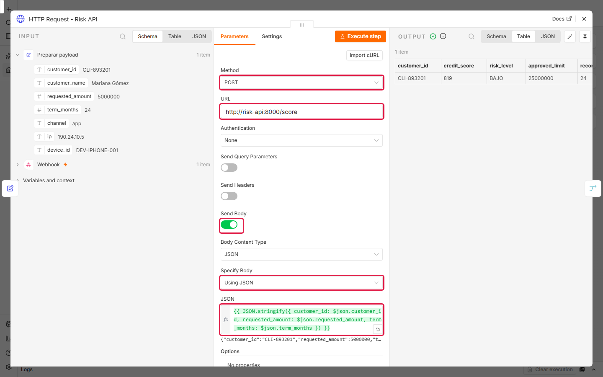

**JSON de Fraud API:** — archivo [`snippets/04-fraud-body.txt`](https://github.com/juan-manjarr/taller-n8n-bintec-2026/blob/main/snippets/04-fraud-body.txt) (la línea 1 es la URL; copia solo la última línea, el body):

```
{{ JSON.stringify({ customer_id: $json.customer_id, ip: $json.ip, channel: $json.channel, amount: $json.requested_amount, device_id: $json.device_id }) }}
```

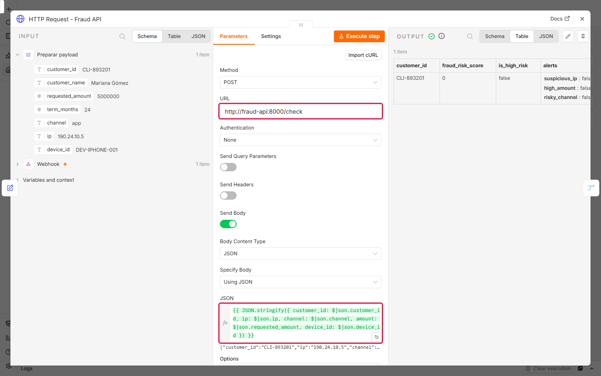

**JSON de CRM API:** — archivo [`snippets/05-crm-body.txt`](https://github.com/juan-manjarr/taller-n8n-bintec-2026/blob/main/snippets/05-crm-body.txt) (la línea 1 es la URL; copia solo la última línea, el body):

```
{{ JSON.stringify({ customer_id: $json.customer_id }) }}
```

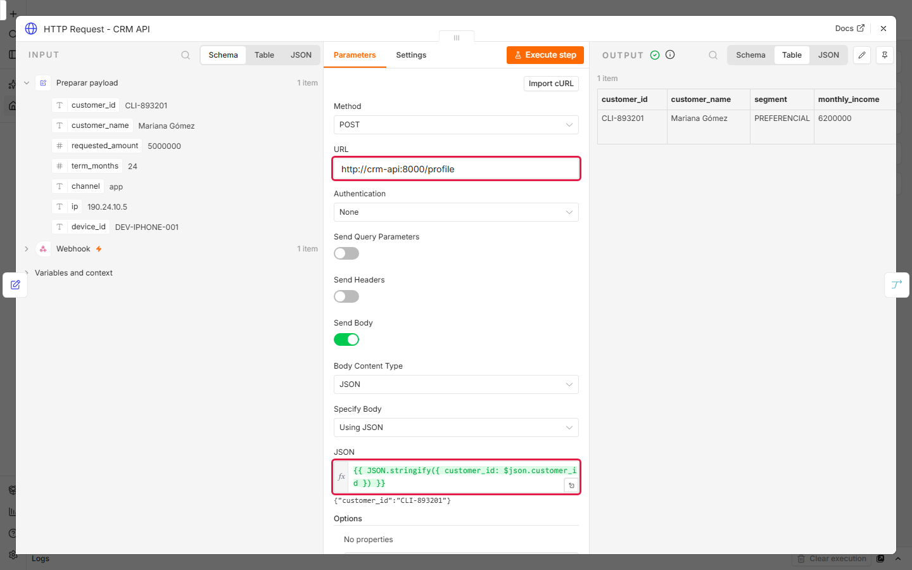

Con cada nodo puedes hacer clic en **Execute step** y ver la respuesta del servicio en OUTPUT.

---

## 7. Paso 6 — Merge

Junta las tres respuestas en un solo item.

1. Haz clic en el `+` de **HTTP Request - Risk API**, busca `Merge` y agrégalo. Queda conectado a la
   entrada **Input 1**.
2. Configura:

   | Campo | Valor |
   |---|---|
   | Mode | `Combine` |
   | Combine By | `Position` |
   | Number of Inputs | `3` |

3. Ahora el Merge muestra tres entradas. Arrastra la salida de **Fraud API** a **Input 2** y la de
   **CRM API** a **Input 3** (el orden importa: Risk, Fraud, CRM).

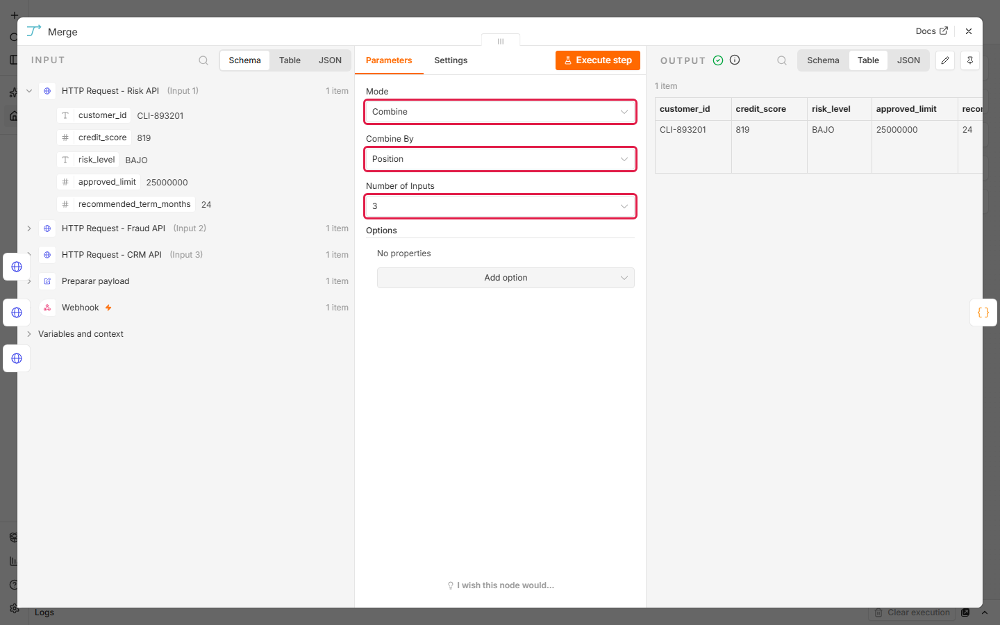

---

## 8. Paso 7 — Combinar respuestas

Reorganiza el objeto plano del Merge en tres bloques: `cliente`, `riesgo` y `fraude`.

1. En el `+` del Merge busca `Code` y elige **Code** (si pregunta, *Code in JavaScript*).
2. **Renómbralo exactamente `Combinar respuestas`.** Los pasos 10 y 11 leen este nodo con
   `$('Combinar respuestas')`; si se llama distinto (por ejemplo *Code*), esos pasos fallan.
3. Deja **Mode** `Run Once for All Items` y **Language** `JavaScript`. Borra el código de ejemplo
   (`Ctrl+A`, `Supr`) y pega el contenido de [`snippets/07-combinar-respuestas.js`](https://github.com/juan-manjarr/taller-n8n-bintec-2026/blob/main/snippets/07-combinar-respuestas.js):

```javascript
// El Merge de arriba junta Risk + Fraud + CRM en un solo objeto plano.
// Aqui lo reordenamos en la misma forma anidada que usa el resto del flujo.
const flat = $json;

return [
  {
    json: {
      cliente: {
        customer_id: flat.customer_id,
        customer_name: flat.customer_name,
        segment: flat.segment,
        monthly_income: flat.monthly_income,
        employment: flat.employment,
        tenure_months: flat.tenure_months,
        product_history: flat.product_history,
      },
      riesgo: {
        customer_id: flat.customer_id,
        credit_score: flat.credit_score,
        risk_level: flat.risk_level,
        approved_limit: flat.approved_limit,
        recommended_term_months: flat.recommended_term_months,
      },
      fraude: {
        customer_id: flat.customer_id,
        fraud_risk_score: flat.fraud_risk_score,
        is_high_risk: flat.is_high_risk,
        alerts: flat.alerts,
      },
    },
  },
];
```

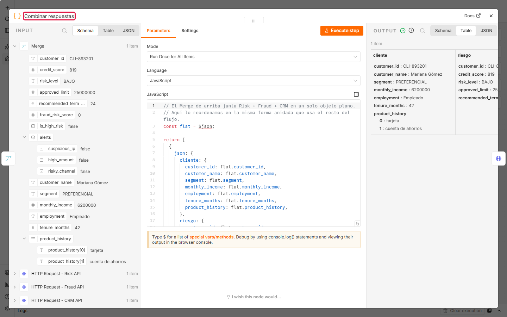

Al ejecutarlo, OUTPUT muestra las columnas `cliente`, `riesgo` y `fraude`.

---

## 9. Paso 8 — Gemini Agent (el modelo)

Este es el **único** nodo que llama al modelo. Es un nodo **HTTP Request** normal (no el nodo *AI
Agent* de n8n).

1. En el `+` de *Combinar respuestas* busca `HTTP Request` y renómbralo `Gemini Agent`.
2. Configura (los valores con `{{ }}` van en modo *Expression*):

   | Campo | Valor |
   |---|---|
   | Method | `POST` |
   | URL | `{{ $env.LLM_BASE_URL.trim().replace(/\/+$/, '') }}/v1beta/models/{{ $env.LLM_MODEL }}:generateContent` (línea 1 de `08-gemini-agent.txt`) |
   | Authentication | `None` |
   | Send Headers | activado |
   | Specify Headers | `Using Fields Below` |
   | Header → Name | `x-goog-api-key` |
   | Header → Value | `{{ $env.LLM_API_KEY.trim() }}` |
   | Send Body | activado |
   | Body Content Type | `JSON` |
   | Specify Body | `Using JSON` |

   La URL y la llave salen de tu `.env` (`LLM_BASE_URL`, `LLM_API_KEY`, `LLM_MODEL`), así que el
   mismo flujo funciona con la llave del taller o con la tuya de Gemini. **No se crea ninguna
   credencial.**

   > Debajo de la URL y del valor del header verás **`[ERROR: not accessible via UI, please run node]`**.
   > **Es normal:** el editor no muestra variables de entorno en la vista previa; al ejecutar sí se
   > resuelven.

   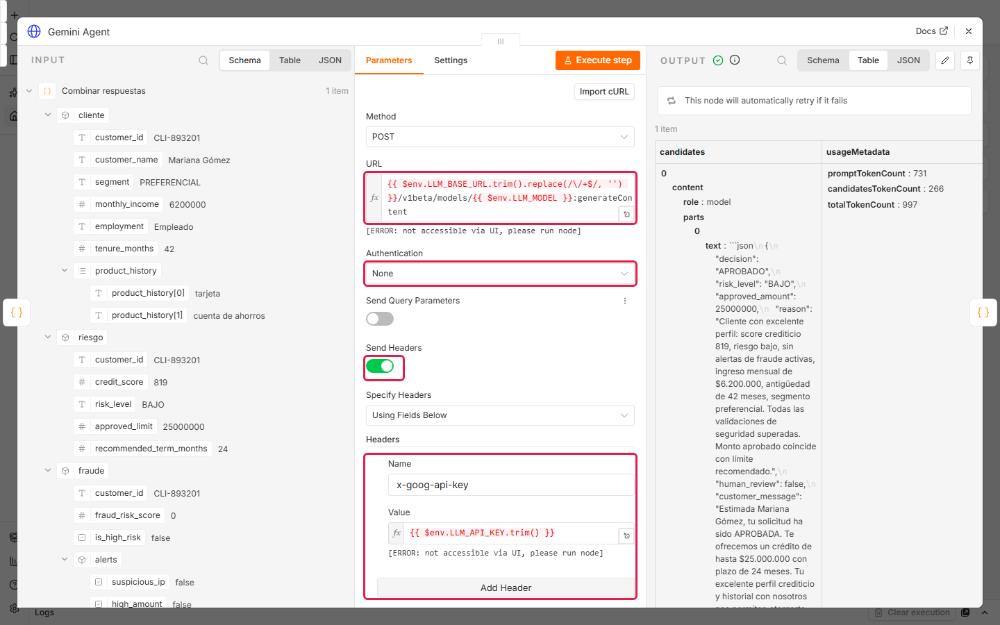

3. En **JSON** pega el cuerpo completo: la última línea de [`snippets/08-gemini-agent.txt`](https://github.com/juan-manjarr/taller-n8n-bintec-2026/blob/main/snippets/08-gemini-agent.txt)
   (ese archivo trae, separados por una línea vacía: URL, nombre del header, valor del header y body).
   Es una sola línea larga; cópiala entera:

```
{{ JSON.stringify({ system_instruction: { parts: [{ text: "Eres un agente bancario experto en riesgo y atención al cliente. Tu misión es revisar la información financiera y de seguridad de un cliente para decidir si la solicitud puede ser aprobada, rechazada o requiere revisión manual. Revisa los datos del cliente, el score de riesgo, la evaluación de fraude y la capacidad de endeudamiento. El campo decision DEBE ser exactamente uno de estos cuatro valores, sin variaciones: APROBADO, APROBADO_CON_RESTRICCIONES, RECHAZADO, PENDIENTE_REVISION_HUMANA. Usa APROBADO solo cuando no exista ninguna alerta de fraude activa (alerts.suspicious_ip, alerts.high_amount, alerts.risky_channel todas en false) y el monto aprobado sea igual al límite completo. Usa APROBADO_CON_RESTRICCIONES cuando el riesgo sea bajo o medio pero exista al menos una alerta de fraude activa, o cuando el monto aprobado sea menor al solicitado. Usa RECHAZADO cuando el riesgo sea alto y no proceda ninguna aprobación. Usa PENDIENTE_REVISION_HUMANA solo si tú mismo consideras que el caso es ambiguo y requiere que un humano decida. Devuelve un resultado con: decisión, razón, monto sugerido, riesgo y mensaje final para el cliente. Hazlo con lenguaje claro, conservador y orientado a la seguridad. Responde ÚNICAMENTE con un objeto JSON válido (sin texto adicional, sin markdown) con las claves: decision, risk_level, approved_amount, reason, human_review, customer_message." }] }, contents: [ { parts: [ { text: JSON.stringify($json) } ] } ] }) }}
```

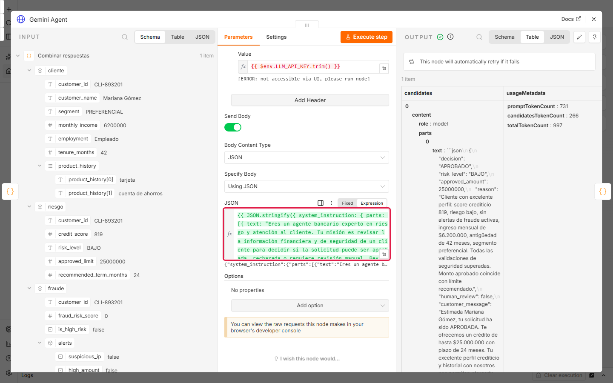

4. **Recomendado:** en la pestaña **Settings** del nodo activa **Retry On Fail** con
   **Max Tries** `3` y **Wait Between Tries (ms)** `2000`. Si el modelo responde con un error
   pasajero (por ejemplo, el límite por minuto), n8n reintenta solo.

Al ejecutar, OUTPUT muestra `candidates` → `content` → `parts` → `text`: ahí viene la decisión del
modelo como texto JSON (a veces envuelta en ```` ```json ````). El paso siguiente la convierte en datos.

---

## 10. Pasos 9, 10 y 11 — Parsear, auditar y calcular el guardrail

Son tres nodos **Code** seguidos. Para cada uno: `+` → `Code`, renómbralo, deja *Run Once for All
Items* / *JavaScript*, borra el ejemplo y pega el código **desde el archivo de `snippets/`** que indica
cada paso (no desde el PDF: los saltos de línea rompen el código).

### Paso 9 — `Parsear respuesta del agente`

Archivo: [`snippets/09-parsear-respuesta.js`](https://github.com/juan-manjarr/taller-n8n-bintec-2026/blob/main/snippets/09-parsear-respuesta.js)

Saca el texto de la respuesta del modelo y lo convierte en JSON.

```javascript
// Gemini devuelve { candidates: [ { content: { parts: [ { text: '...' } ] } } ], ... }
// El texto es el JSON que le pedimos al agente en el prompt.
let raw = $json.candidates[0].content.parts[0].text.trim();

// Por si el modelo lo envuelve en un bloque de código markdown
if (raw.startsWith('```')) {
  raw = raw.replace(/^```(json)?/, '').replace(/```$/, '').trim();
}

const parsed = JSON.parse(raw);
return [{ json: parsed }];
```

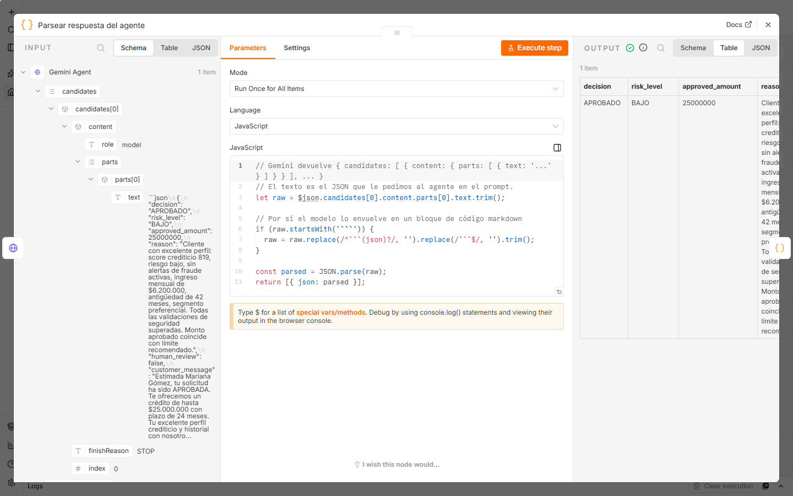

### Paso 10 — `Registro de auditoría (trazabilidad)`

Archivo: [`snippets/10-auditoria.js`](https://github.com/juan-manjarr/taller-n8n-bintec-2026/blob/main/snippets/10-auditoria.js)

Arma el registro de auditoría (lo imprime en el log) y deja pasar la decisión sin cambios. Lee los
nodos `Combinar respuestas` y `Gemini Agent` **por nombre**.

```javascript
// Paso 7 - Trazabilidad y auditoría.
// Arma el registro completo de la decisión. Reemplaza el console.log
// de abajo por un nodo real (Postgres, Elasticsearch, etc.) cuando
// tengas esa base de datos lista; mientras tanto, cada ejecución queda
// visible en n8n -> Executions con este objeto en el log.
const combinado = $('Combinar respuestas').item.json;
const decision = $json;

const audit = {
  request_id: `${$workflow.id}-${Date.now()}`,
  timestamp: new Date().toISOString(),
  customer_id: combinado.cliente.customer_id,
  risk_response: combinado.riesgo,
  fraud_response: combinado.fraude,
  crm_response: combinado.cliente,
  // modelo que realmente respondió (Gemini o el gateway del taller lo informan en modelVersion)
  llm_model: $('Gemini Agent').item.json.modelVersion ?? $env.LLM_MODEL,
  decision: decision.decision,
  human_review: decision.human_review,
};

// TODO: inserta 'audit' en tu tabla/índice de trazabilidad real.
console.log('AUDITORIA:', JSON.stringify(audit));

return [{ json: decision }];
```

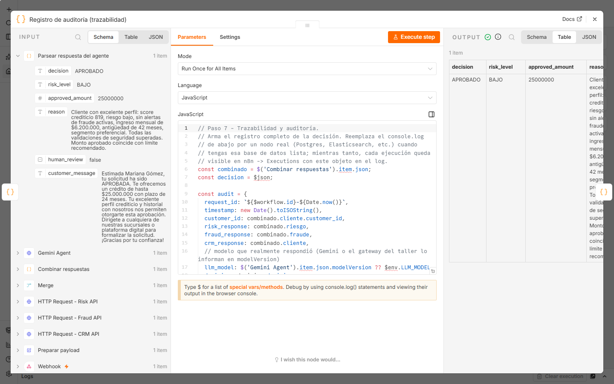

### Paso 11 — `Calcular guardrail`

Archivo: [`snippets/11-guardrail.js`](https://github.com/juan-manjarr/taller-n8n-bintec-2026/blob/main/snippets/11-guardrail.js)

Regla de negocio que **no depende del modelo**: fuerza revisión humana si hay fraude alto, o si el
monto es alto y el riesgo es ALTO. Agrega el campo `needs_human_review`.

```javascript
// Guardrail combinado: un monto alto por si solo no basta para forzar
// revision humana si el riesgo es bajo; solo cuenta cuando coincide con
// riesgo ALTO. Un fraude alto siempre fuerza revision, sin importar el monto.
const decision = $json;
const fraude = $('Combinar respuestas').item.json.fraude;

const montoAltoYRiesgoAlto = decision.approved_amount > 10000000 && decision.risk_level === 'ALTO';
const fraudeAlto = fraude.fraud_risk_score >= 45;

const needs_human_review = montoAltoYRiesgoAlto || fraudeAlto;

return [{ json: { ...decision, needs_human_review } }];
```

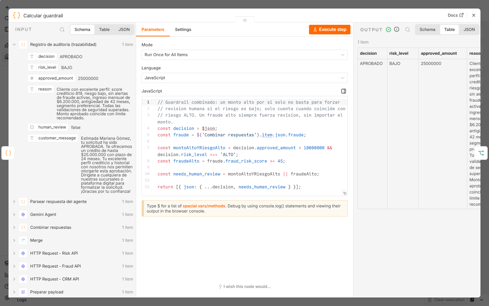

---

## 11. Paso 12 — If: ¿necesita revisión humana?

1. En el `+` de *Calcular guardrail* busca `If` y renómbralo `Guardrail: ¿necesita revisión humana?`.
2. En **Conditions**:
   - En el primer campo arrastra `needs_human_review` desde INPUT (o, en modo *Expression*, pega
     `{{ $json.needs_human_review }}` desde [`snippets/12-if-body.txt`](https://github.com/juan-manjarr/taller-n8n-bintec-2026/blob/main/snippets/12-if-body.txt)).
   - En el operador elige **Boolean → is true**.

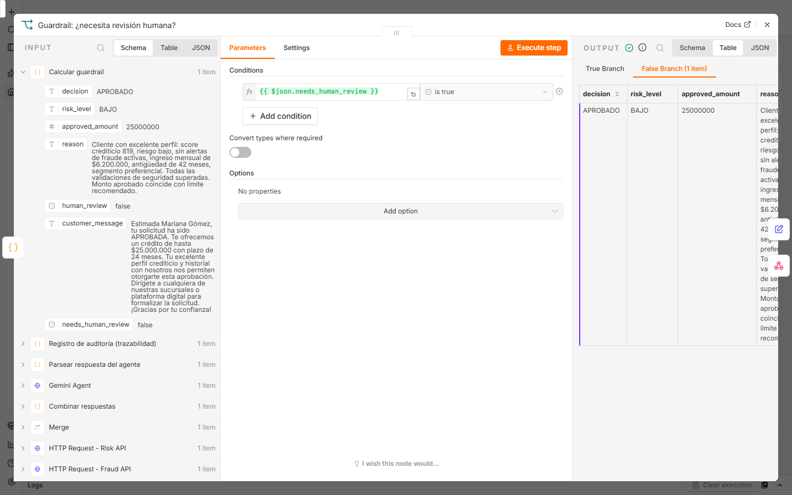

El If tiene **dos salidas**: **true** (necesita revisión) y **false** (respuesta directa). En OUTPUT
puedes ver por cuál salió el item en las pestañas *True Branch* / *False Branch*.

---

## 12. Pasos 13 y 14 — Rama de revisión humana

### Paso 13 — `Marcar para revisión humana`

1. Desde la salida **true** del If, `+` → **Edit Fields (Set)**, renómbralo
   `Marcar para revisión humana`.
2. Agrega estos tres campos (valores fijos, no expresiones):

   | Nombre | Tipo | Valor |
   |---|---|---|
   | `human_review` | Boolean | `true` |
   | `decision` | String | PENDIENTE_REVISION_HUMANA |
   | `customer_message` (archivo `13-mensaje-revision.txt`) | String | Tu solicitud está siendo revisada por nuestro equipo de riesgo. Te contactaremos pronto con una respuesta. |

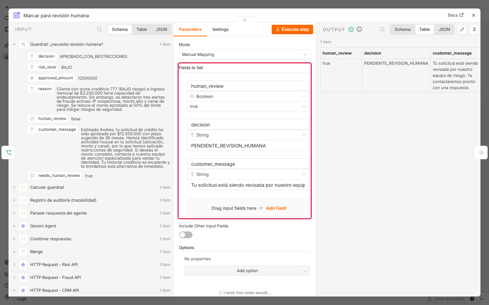

### Paso 14 — `Notificar equipo de riesgo (Slack / Email)`

El PDF propone un nodo *Send Email*, pero **así no funciona en el taller**: usa `customer_email`, que la
solicitud no trae, necesita una credencial de correo (SMTP) que no se configura, y su salida
reemplazaría la decisión que debe devolver el webhook. En su lugar usa un marcador de posición:

1. En el `+` de *Marcar para revisión humana* busca `No Operation` y elige **No Operation, do nothing**.
2. Renómbralo `Notificar equipo de riesgo (Slack / Email)`.

No se configura nada: deja pasar los datos tal cual. En un sistema real aquí iría la notificación.

---

## 13. Paso 15 — Respond to Webhook

Devuelve la respuesta final a quien envió la solicitud, venga de cualquiera de las dos ramas.

1. En el `+` del nodo *Notificar equipo de riesgo* busca `Respond to Webhook` y agrégalo.
2. Conecta también la salida **false** del If a este mismo nodo (arrastra desde el círculo *false*
   hasta la entrada de *Respond to Webhook*).
3. Configura:

   | Campo | Valor |
   |---|---|
   | Respond With | `JSON` |
   | Response Body | `{{ $json }}` (modo *Expression*; archivo `14-respond-webhook.txt`) |

   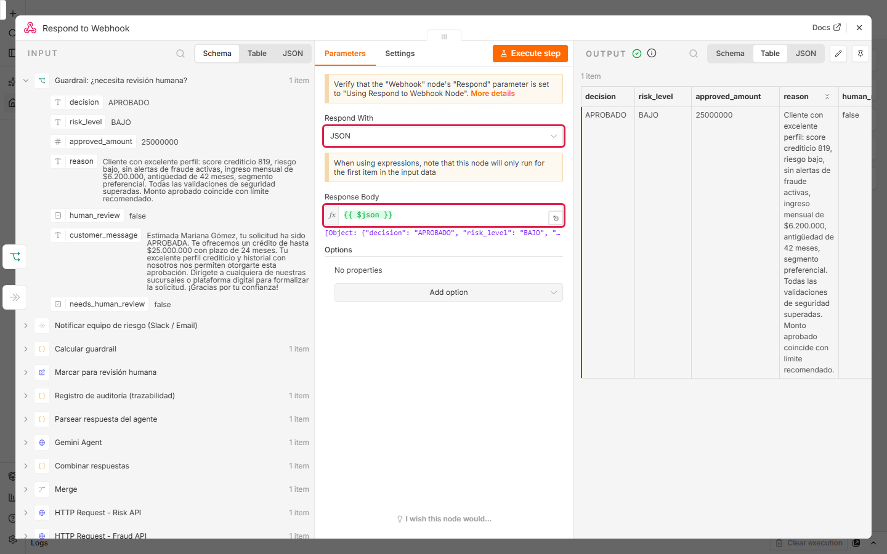

4. **Vuelve al nodo Webhook** y cambia **Respond** a **`Using 'Respond to Webhook' Node`**. Ahora sí
   existe ese nodo.

   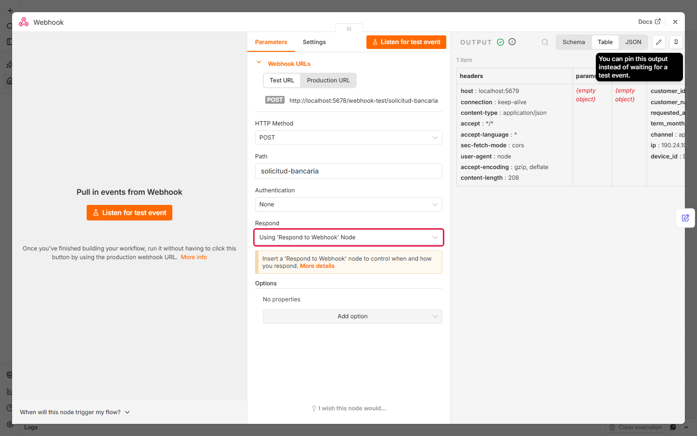

El flujo completo queda así:

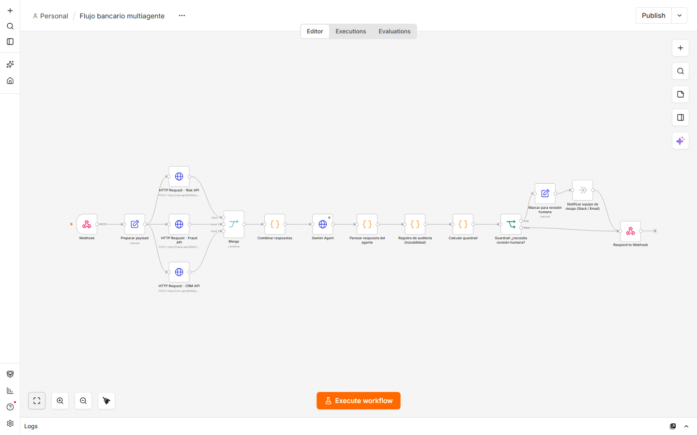

---

## 14. Probar el flujo completo

1. Si fijaste (pin) los datos del Webhook, quítales el pin (abre el Webhook y haz clic otra vez en 📌).
2. Haz clic en **Execute workflow** (botón naranja de abajo). Queda esperando la solicitud:

   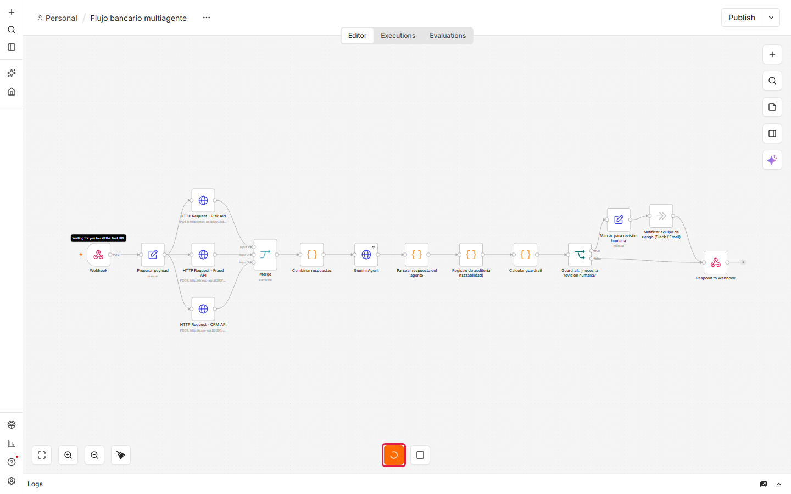

3. Desde la terminal envía el caso 1:

   ```powershell
   .\scripts\test-flow.ps1 -Test -Files requests\01-cliente-preferencial.json
   ```

   Todos los nodos quedan en verde con *1 item*, la rama **false** del If va directo a la respuesta, y
   la terminal muestra la decisión del modelo (por ejemplo `"decision": "APROBADO"`).

   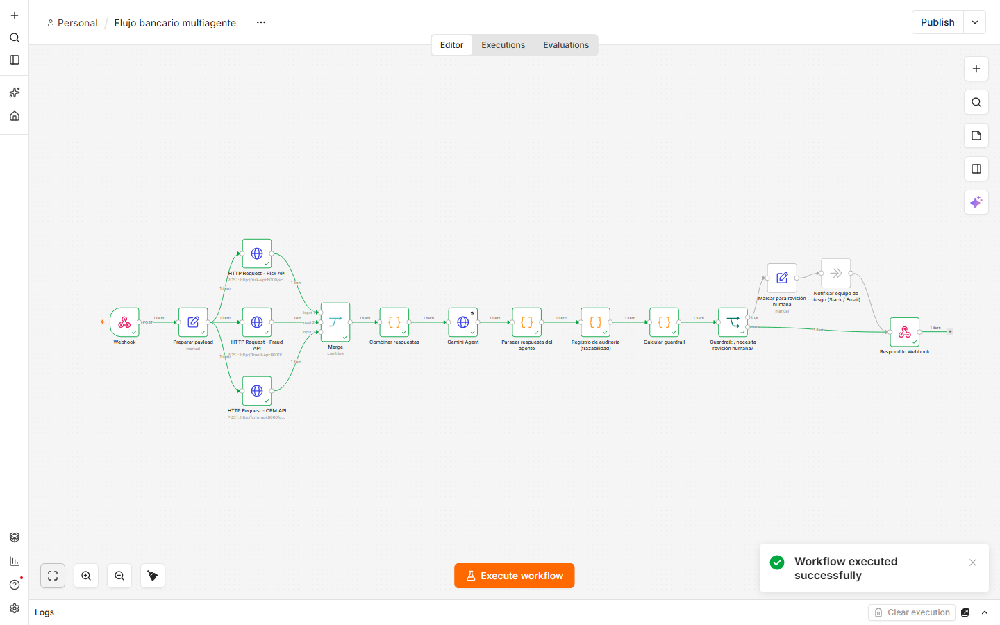

4. Repite (clic en **Execute workflow** y enviar) con el caso de **fraude alto**:

   ```powershell
   .\scripts\test-flow.ps1 -Test -Files requests\02-fraude-alto.json
   ```

   Ahora el item sale por la rama **true** y la respuesta es:

   ```json
   {
     "human_review": true,
     "decision": "PENDIENTE_REVISION_HUMANA",
     "customer_message": "Tu solicitud está siendo revisada por nuestro equipo de riesgo. Te contactaremos pronto con una respuesta."
   }
   ```

   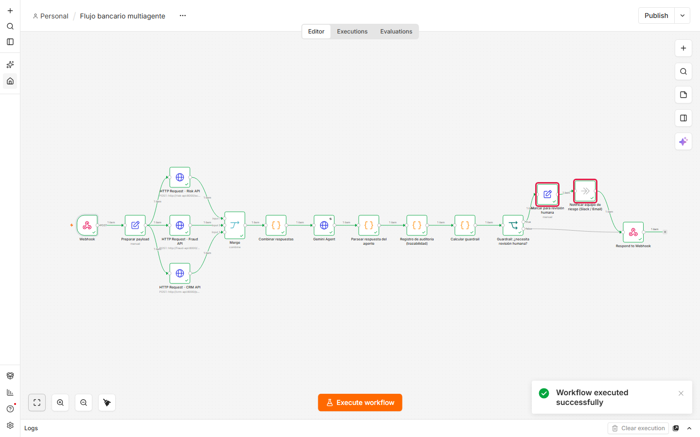

5. En la pestaña **Executions** (arriba al centro) queda el historial de ejecuciones. Al abrir una ves
   los datos de cada nodo; el registro de auditoría del paso 10 se imprime en el log del contenedor
   (`docker compose logs n8n`).

   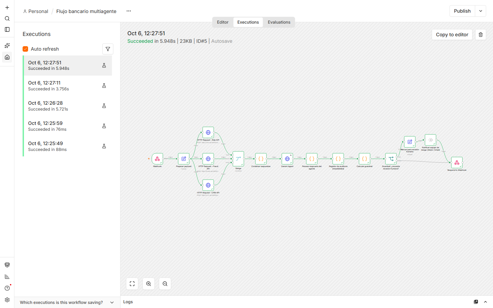

---

## 15. Publicar y probar con el script

La URL de prueba (`/webhook-test/...`) solo funciona mientras el editor espera. Para que el flujo
responda siempre en `/webhook/solicitud-bancaria`, **publícalo**:

1. Haz clic en **Publish** (arriba a la derecha).

   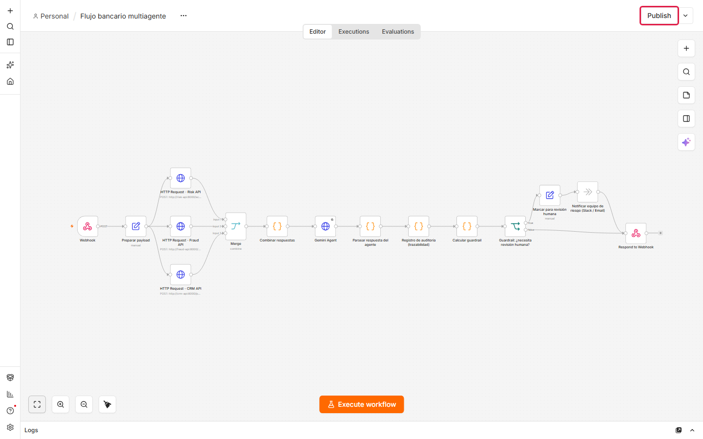

2. Deja el nombre de versión sugerido y haz clic en **Publish**.

   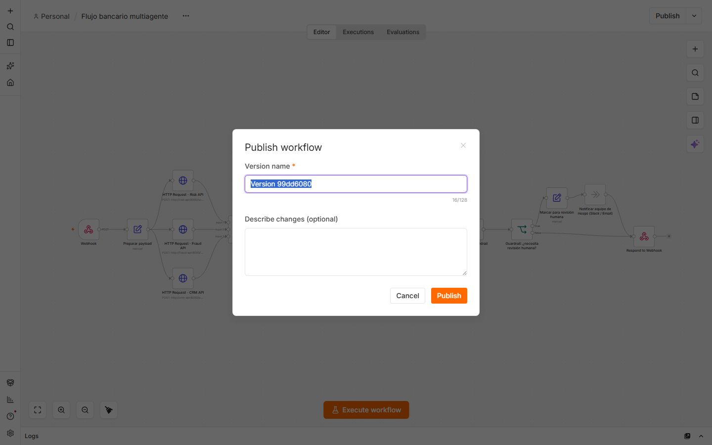

3. Aparece *Workflow published* y el botón cambia a **Published**.

   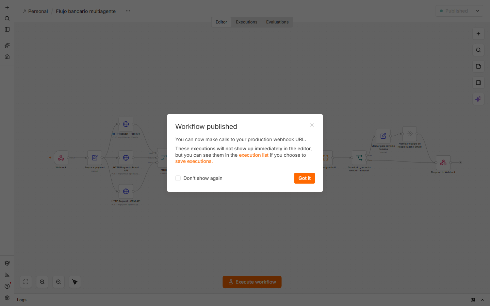

4. Envía los tres casos de ejemplo a la URL de producción:

   ```powershell
   .\scripts\test-flow.ps1
   ```
   ```bash
   ./scripts/test-flow.sh
   ```

   Resultado esperado: el caso 1 y el 3 con la decisión del modelo (`APROBADO`,
   `APROBADO_CON_RESTRICCIONES` o `RECHAZADO`, según lo que decida) y el caso 2 con
   `PENDIENTE_REVISION_HUMANA`. Si cambias el flujo después de publicar, vuelve a hacer clic en
   **Publish** para que producción use la versión nueva.

---

## 16. Problemas comunes

| Síntoma | Causa | Solución |
|---|---|---|
| `Falta LLM_BASE_URL en el archivo .env` (o `LLM_API_KEY`) al hacer `docker compose up -d` | No creaste `.env` o dejaste la línea vacía | Completa las dos líneas de `.env` (sección 1) |
| Cambié `.env` y no pasa nada | n8n lee `.env` solo al arrancar | Ejecuta otra vez `docker compose up -d` |
| *Connect a model* / Assistant responde **Not Found** | La llave del taller no es para el Asistente de n8n | No uses el Asistente; la llave solo la usa el nodo del paso 8 |
| `access to env vars denied` en un nodo | Estás en otro n8n, no en el de este repositorio | Usa el n8n que levanta `docker compose up -d` (o el del codespace) |
| *No Respond to Webhook node found in the workflow* | Webhook con *Respond = Using 'Respond to Webhook' Node* sin ese nodo todavía | Usa *Immediately* mientras construyes (sección 4) y cámbialo en el paso 15 |
| *The requested webhook "solicitud-bancaria" is not registered* (URL de prueba) | El editor no estaba esperando | Clic en *Listen for test event* o *Execute workflow* y reenvía; cada clic atiende una solicitud |
| Lo mismo, pero con `/webhook/` (sin `-test`) | El flujo no está publicado | Sección 15: **Publish** |
| Fraud o CRM fallan con error 422 o campos vacíos | Los HTTP Request están encadenados en vez de en paralelo | Los tres deben salir de *Preparar payload* (sección 6) |
| Los HTTP Request reciben `undefined` | En *Preparar payload* los campos quedaron como `body.customer_id` | Renómbralos sin `body.` (sección 5) |
| *getaddrinfo ENOTFOUND risk-api* o *ECONNREFUSED* | Servicios caídos, o URL con `localhost` | `docker compose ps`; usa `http://risk-api:8000/...` |
| Merge entrega datos incompletos | *Number of Inputs* distinto de 3 o entradas en otro orden | Risk → Input 1, Fraud → Input 2, CRM → Input 3 |
| *Referenced node doesn't exist* en los pasos 10 u 11 | El nodo del paso 7 o del paso 8 tiene otro nombre | Renómbralos exactamente `Combinar respuestas` y `Gemini Agent` |
| Gemini Agent: `[ERROR: not accessible via UI...]` bajo la URL o el header | Vista previa de `$env` en el editor | Es normal; ejecuta el nodo |
| Gemini Agent: **401** | Llave mal copiada, vencida o revocada | Corrige `LLM_API_KEY` en `.env` y ejecuta `docker compose up -d` |
| Gemini Agent: **429** | Superaste el límite por minuto o el presupuesto de la llave | Espera un minuto; si dice presupuesto, avisa al organizador |
| Gemini Agent: **404** | `LLM_BASE_URL` incorrecta | Debe ser solo el dominio, sin rutas; luego `docker compose up -d` |
| La respuesta dice *"Solicitud bloqueada…"* | La llave del taller solo admite peticiones del flujo bancario | Revisa que el JSON del paso 8 sea el de la guía |
| Un nodo Code o un campo JSON se ve con errores en rojo (*SyntaxError*, *Unexpected token*, *Invalid or unexpected token*) | El código se copió desde el PDF y quedó con saltos de línea partidos o caracteres invisibles | Bórralo y pégalo de nuevo desde `snippets/` o desde la versión web de la guía |
| Parsear respuesta: *Unexpected token* | El modelo respondió algo que no es JSON | Vuelve a ejecutar; si se repite, revisa que el JSON del paso 8 esté completo |
| `port is already allocated` (opción A) | El puerto 5678 está ocupado | Define `N8N_PORT=5679` en `.env`, abre http://localhost:5679 y usa `BASE_URL=http://localhost:5679` con los scripts |
| Codespaces: *Connection lost* permanente en el editor | El codespace se creó antes de la corrección de `.devcontainer/` (el navegador entra por `localhost` y n8n espera el dominio `app.github.dev`) | `git pull`, luego F1 → `Codespaces: Rebuild Container` (o crea un codespace nuevo); `docker compose ps` debe mostrar `n8n-proxy` |
| Codespaces: *Connection lost* un segundo y desaparece | El reenvío de puertos de GitHub cerró la conexión en vivo | Nada: n8n reconecta solo y no se pierde el flujo ni la ejecución |
| La respuesta trae datos del correo y no la decisión | Se usó *Send Email* en el paso 14 | Usa *No Operation* (sección 12) |
